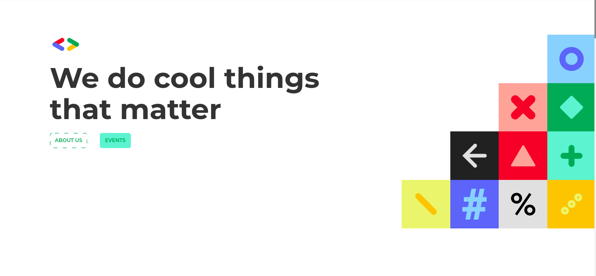

<!-- PROJECT LOGO -->
<br />
<p align="center">
  <a href="https://github.com/GDGAlgiers/GDG-website-2020">
    
  </a>

  <h3 align="center">GDG Algiers Website</h3>

  <p align="center">
    The Repository for GDG Website made with Gatsby and Firebase
    <br />
    <br />
    <br />
    <a href="https://github.com/GDGAlgiers/GDG-website-2020">View Demo</a>
    ·
    <a href="https://github.com/GDGAlgiers/GDG-website-2020/issues">Report Bug</a>
    ·
    <a href="https://github.com/GDGAlgiers/GDG-website-2020/issues">Request Feature</a>
  </p>
</p>


<!-- TABLE OF CONTENTS -->
<details open="open">
  <summary><h2 style="display: inline-block">Table of Contents</h2></summary>
  <ol>
    <li>
      <a href="#about-the-project">About The Project</a>
      <ul>
        <li><a href="#built-with">Built With</a></li>
      </ul>
    </li>
    <li>
      <a href="#getting-started">Getting Started</a>
      <ul>
        <li><a href="#prerequisites">Prerequisites</a></li>
        <li><a href="#installation">Installation</a></li>
      </ul>
    </li>
    <li><a href="#usage">Usage</a></li>
    <li><a href="#project-structure">Project Structure</a></li>
    <li><a href="#contributing">Contributing</a></li>
    <li><a href="#license">License</a></li>
    <li><a href="#contact">Contact</a></li>
  </ol>
</details>


<!-- ABOUT THE PROJECT -->
## About The Project

<p align="center">
  <a href="https://github.com/GDGAlgiers/GDG-website-2020">
    
  </a>
</p>

Hack The Bot is a **Hackathon** organized by `GDG Algiers` & `WTM Algiers` where participants will try to build solutions based on the theme of bots multiple platforms can be used like `discord`, `slack`, `telegram`, `chatbots`, and many more ... 
<br />

This repository hold both the Website and the API that will provide content of event to consumers as a **REST API** .

link to site: <a href="https://www.gdgalgiers.com">https://www.gdgalgiers.com</a>


### Built With

* [Gatsby](https://www.gatsbyjs.com/)
* [Firebase](https://firebase.google.com/)


<!-- GETTING STARTED -->
## Getting Started

To get a local copy up and running follow these simple steps.

### Prerequisites

Before you begin you need to install nodejs and then install yarn and gatsby-cli
* Yarn
  ```sh
  $ npm install --global yarn
  ```
* Gatsby CLI 
  ```sh
  $ npm install --global gatsby-cli
  ```

### Installation

1. Clone the repo and cd to it
   ```sh
    $ git clone https://github.com/GDGAlgiers/GDG-website-2020.git 
    $ cd GDG-website-2020
   ```
2. Install the necessary dependencies for the project
   ```sh
    $ yarn install
   ```
3. Create `.env` file to put the project's environment variables there
   ```sh
    $ cp .env.example .env
   ```
   If you want to contribute, you will need the values of the environment variables. So feel free to contact us to get them.

<!-- USAGE EXAMPLES -->
## Usage
1. Running The Gatsby Project
   ```sh
    $ gatsby develop 
   ```
Visit `http://localhost:8000/` to view the app.


<!-- PROJECT STRUCTURE -->
## Project-Structure

``` 
    /src/
        --> components/ # This folder contains the components used in the project 
        --> constants/ # This folder contains some configurations and the used colors in the project 
        ---> content/  # This folder has files containing the content used in the different sections of the website
        ---> firebase/ # This folder contains Firebase configuration for the project
        ---> images/ # This folder contains all the images used in the project
        ---> pages/ # This folder contains all the pages components built in the project
        ---> services/ # This folder contains the messaging setup for the contact section
        ---> styles/ # This folder contains the stylesheets used in the project
```


<!-- CONTRIBUTING -->
## Contributing

Contributions are what make the open source community such an amazing place to be learn, inspire, and create. Any contributions you make are **greatly appreciated**.

1. Fork the Project
2. Create your Feature Branch (`git checkout -b feature/githubName/AmazingFeature`)
3. Commit your Changes (`git commit -m 'Add some AmazingFeature'`)
4. Push to the Branch (`git push origin feature/githubName/AmazingFeature`)
5. Open a Pull Request


<!-- LICENSE -->
## License

Distributed under the Apache License. See `LICENSE` for more information.


<!-- CONTACT -->
## Contact

GDG Algiers - [@gdg_algiers](https://twitter.com/gdg_algiers) - gdg.algiers@esi.dz

Project Link: [https://github.com/GDGAlgiers/GDG-website-2020](https://github.com/GDGAlgiers/GDG-Website-2020)